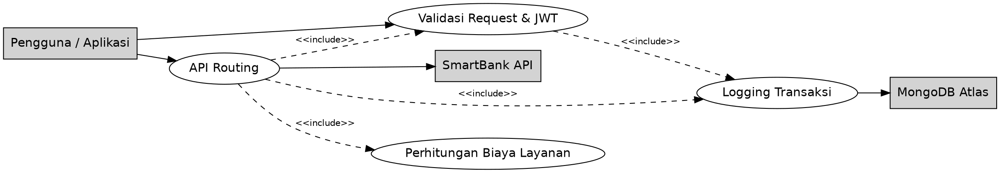
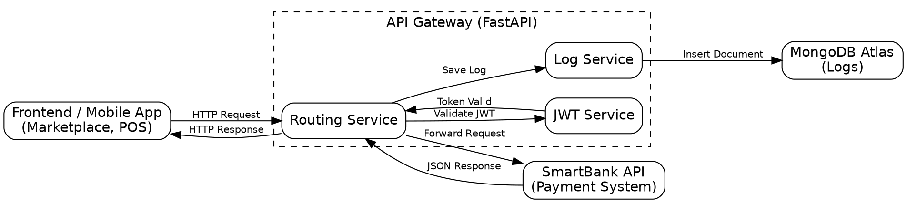
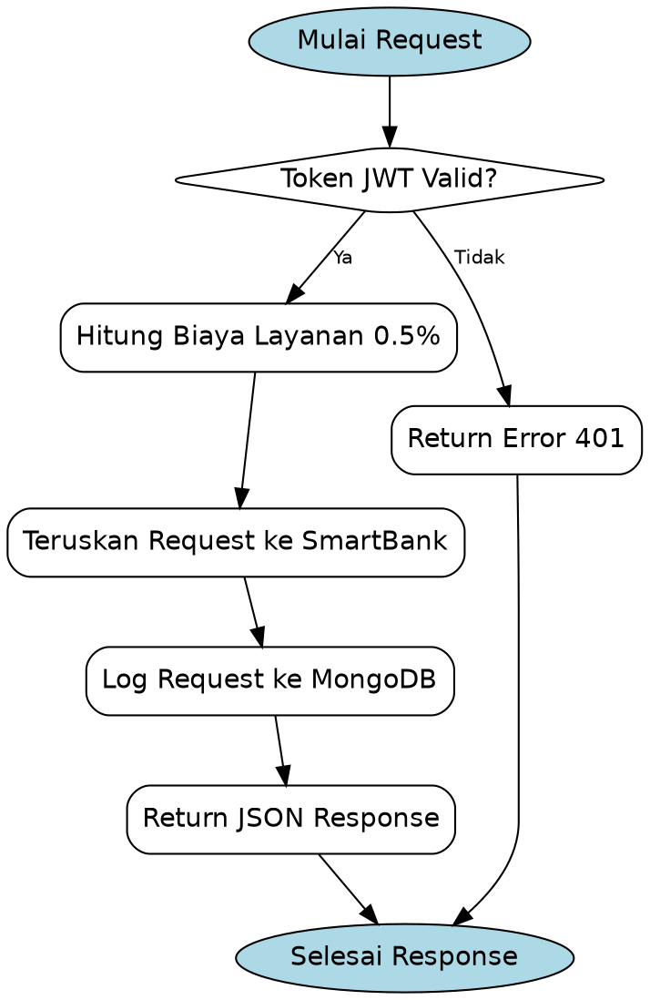
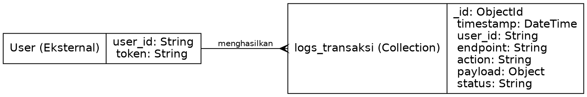
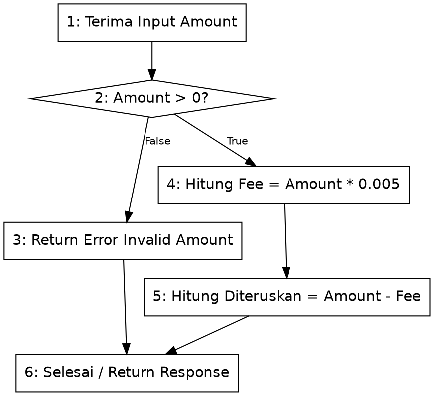

# DOKUMEN DESAIN - API Gateway / Integrator UMKM

## 1. Deskripsi Aplikasi
API Gateway / Integrator UMKM adalah *middleware orchestrator* yang berfungsi sebagai pintu masuk tunggal (*single entry point*) bagi seluruh *request* antar aplikasi dalam ekosistem ekonomi UMKM. Aplikasi ini menjembatani berbagai layanan seperti Marketplace, Point of Sales (POS), dan sistem pembayaran eksternal (SmartBank).

**Stakeholder Utama:**
- Pengguna UMKM (Merchant & Customer)
- Aplikasi Ekosistem (Marketplace, POS, dll)
- Sistem Perbankan/Pembayaran (SmartBank)

---

## 2. Use Case / Fitur Utama
Fitur utama dari sisi fungsionalitas mencakup:
- **Validasi Request (JWT):** Memastikan bahwa *request* yang masuk memiliki token otentikasi yang valid.
- **Routing API:** Meneruskan *request* ke *endpoint* tujuan yang tepat.
- **Logging Transaksi:** Mencatat seluruh histori log *request* (berhasil/gagal) ke dalam *database* (MongoDB).
- **Perhitungan Fee (Biaya Layanan):** Menghitung potongan biaya operasional (*gateway fee* sebesar 0.5%) untuk setiap transaksi.

### Diagram Use Case (Graphviz)

---

## 3. Diagram Arsitektur
Diagram arsitektur menunjukkan blok alur dari aplikasi ke sistem SmartBank melalui Gateway.

---

## 4. Flow Proses (IPO)
Input-Proses-Output tiap fitur utama.

**1. Validasi Request**
- **Input:** Token JWT, User ID
- **Proses:** Decode dan verifikasi token JWT
- **Output:** Status Valid/Invalid

**2. Logging**
- **Input:** Data Request (Endpoint, Action, User ID, Timestamp)
- **Proses:** Insert dokumen JSON ke *collection* MongoDB
- **Output:** Status Insert (Success/Failed)

**3. API Routing & Transaksi**
- **Input:** Payload transaksi (Amount, Recipient ID)
- **Proses:** Forward *payload* ke SmartBank, memproses *response*
- **Output:** Respons JSON dari SmartBank

### Diagram Flowchart Proses (Graphviz)

---

## 5. API Endpoint
| Method | URL | Deskripsi | Request Body | Response Body |
|---|---|---|---|---|
| `POST` | `/integrator/routing_api` | Routing request ke ekosistem | `user_id`, `parameter: {token, amount}` | `status`, `data: {integrator_note, ...}` |
| `POST` | `/integrator/validasi_request` | Validasi Token JWT | `user_id`, `parameter: {token}` | `status`, `data: {pesan}` |
| `POST` | `/integrator/logging` | Simpan log ke DB | `user_id`, `parameter: {endpoint, action}` | `status`, `data: {pesan}` |
| `POST` | `/integrator/biaya_layanan_integrasi` | Hitung fee gateway | `user_id`, `parameter: {amount}` | `status`, `data: {fee, diteruskan}` |
| `GET` | `/generate_token_tester/{user_id}` | Generate token dummy untuk tes | `-` | `token_buat_ngetes` |

---

## 6. Integrasi SmartBank
Aplikasi ini terhubung ke SmartBank sebagai perantara pembayaran (payment gateway bridge). 
- Gateway meneruskan *request* dari pengguna yang ingin melakukan transaksi (misal: checkout di marketplace) menuju endpoint `/smartbank/pembayaran_transaksi` di SmartBank.
- Gateway bertindak sebagai jembatan yang memastikan integritas dan konsistensi data ekonomi ekosistem dengan hanya meloloskan *request* jika Token JWT valid.

---

## 7. Desain Database
Database menggunakan **MongoDB Atlas** (NoSQL).
Collection utama yang digunakan: `logs_transaksi`.

### Diagram ERD (Graphviz)

---

## 8. Mekanisme Transaksi
Setiap transaksi keuangan yang melewati Gateway akan dikenakan biaya operasional/layanan.
Alur logika pembayaran:
1. *User* ingin membayar Rp 100.000.
2. *Request* masuk ke sistem Gateway.
3. Gateway menghitung *Fee* (0.5% x 100.000 = Rp 500).
4. Gateway mencatat dan memisahkan uang *fee*, lalu meneruskan nominal bersih (Rp 99.500) ke tujuan.

### Diagram White Box (Logic Fee)

---

## 9. UI Sederhana
Aplikasi ini memiliki *User Interface* sederhana berbasi HTML statis untuk monitoring dan *testing*:
- **Landing Page (`frontend/landing.html`)**: Menampilkan informasi publik tentang integrasi API UMKM.
- **Login Page (`frontend/login.html`)**: Form untuk mengakses sistem (sistem backend otentikasi dapat dihubungkan ke Gateway).
- **Dashboard (`frontend/index.html`)**: Berfungsi untuk melihat rute layanan dan tes *endpoint*.

*(Desain *mockup* mengacu pada file-file HTML yang ada di dalam folder `frontend`)*

---

## 10. Skenario Pengujian
| Skenario | Input | Expected Output | Status |
|---|---|---|---|
| **Validasi Token Sukses** | Token JWT Valid | HTTP 200, `status: "sukses"` | Pass |
| **Validasi Token Gagal** | Token JWT Kadaluarsa / Salah | HTTP 200/401, `status: "gagal"` | Pass |
| **Hitung Biaya Fee** | Amount: 100000 | Fee: 500, Diteruskan: 99500 | Pass |
| **Routing Transaksi** | Payload Lengkap & Token Valid | Meneruskan response sukses dari SmartBank | Pass |

---

## 11. Kendala & Solusi
- **Kendala:** Koneksi MongoDB kadang terputus atau mengalami *timeout* saat dipanggil secara asinkron (async).
  **Solusi:** Menggunakan library `motor` yang dioptimalkan khusus untuk operasi I/O asinkron di FastAPI, serta menambahkan Network Access IP `0.0.0.0/0` pada dashboard MongoDB Atlas.
- **Kendala:** *Routing request* ke SmartBank ditolak (*connection refused*).
  **Solusi:** Menyamakan standar port yang berjalan pada environment lokal (misalnya API Gateway port `8001` dan SmartBank port `8000`).

---

## 12. Dokumentasi Tim
| Nama Anggota | Peran / Pembagian Tugas |
|---|---|
| Moch Andika R | **BACKEND**: Perancangan arsitektur, setup FastAPI, implementasi *routing service*, integrasi MongoDB, JWT *Auth*, dan *endpoint* biaya layanan. |
| Frhan Malik Ibrahim | **FRONTEND**: Pembuatan tampilan antarmuka (*frontend* UI HTML/CSS) dan penyusunan dokumentasi (termasuk diagram Graphviz). |
